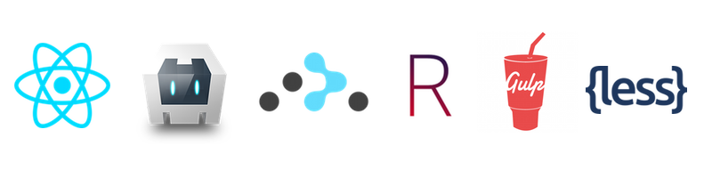

# react-cordova [![travis][travis-image]][travis-url]
[travis-image]: https://travis-ci.org/ekonstantinidis/react-cordova.svg?branch=master
[travis-url]: https://travis-ci.org/ekonstantinidis/react-cordova

A [React](https://facebook.github.io/react/) project template for [Apache Cordova](http://cordova.apache.org/).

### Prerequisites

 - [React](https://facebook.github.io/react/)
 - [Cordova](http://cordova.apache.org/)
 - [Gulp](http://gulpjs.com/)
 - [React Router](http://rackt.github.io/react-router/)
 - [Rachet](http://goratchet.com/)
 - [LESS CSS](http://lesscss.org/)
 - [Font Awesome](http://fontawesome.io/)
 - [NPM](https://www.npmjs.com/)

### Installation

    npm install -g gulp
    npm install

### Development
For development run `npm start`. That will run a server with `live-reload` at `http://localhost:8000` and will also **watch** for any `js` & `LESS` changes.

    npm start

If you only want to build the app use:

    npm run build

### Plugins
In order to install/remove the plugins there is a script in `scripts/plugins.bash`. Simply edit it to add the plugins you want to use.

    # Removes plugins
    bash scripts/plugins.bash remove

    # Installs the plugins
    bash scripts/plugins.bash install

    # Removes and Re-Installs the plugins
    bash scripts/plugins.bash

### Tests

    npm test
